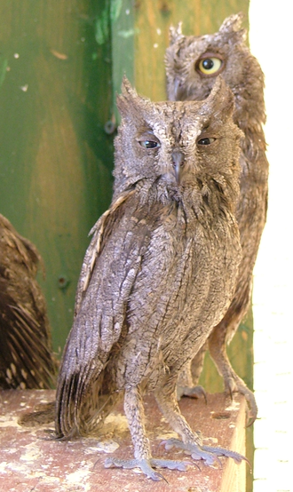

# etl_project
# Team Name: Inquisitive Otus
 

## Objective:

Gather data sources, transform and load into a database. 
Data involves how much campaign contributions each candidate received and success of 2016 campaign

## Libraries / Requirements:
* BeautifulSoup
* pymongo
* splinter import Browser
* Pandas
* Sqlalchemy
* Requests
* JSON
* pprint

## Data Sources:

* https://api.open.fec.gov/developers/ (json)
* https://statewidedatabase.org/d10/p16.html (csv)

## Scrape:
* https://www.nrcs.usda.gov/wps/portal/nrcs/detail/national/home/?cid=nrcs143_013697 

## Database:

* PostgreSQL
